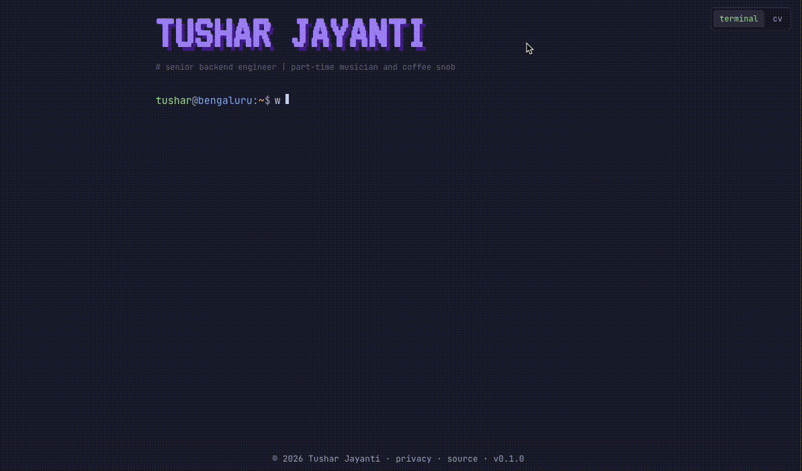
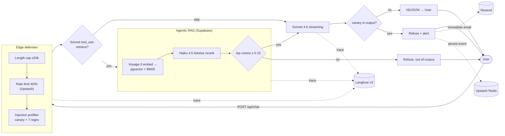
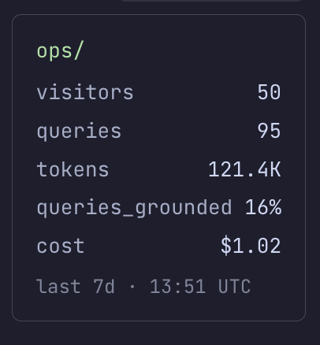
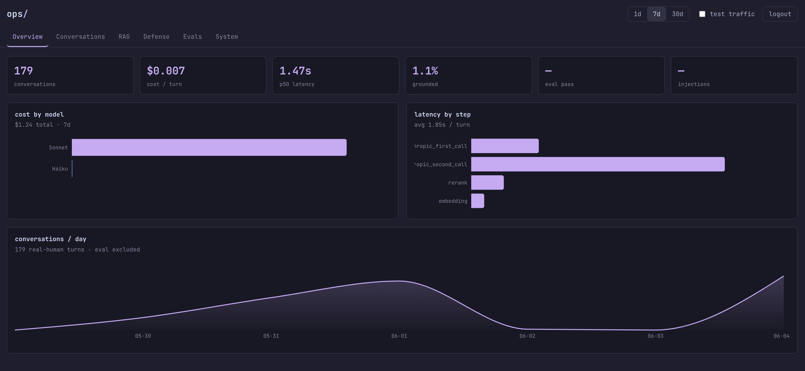
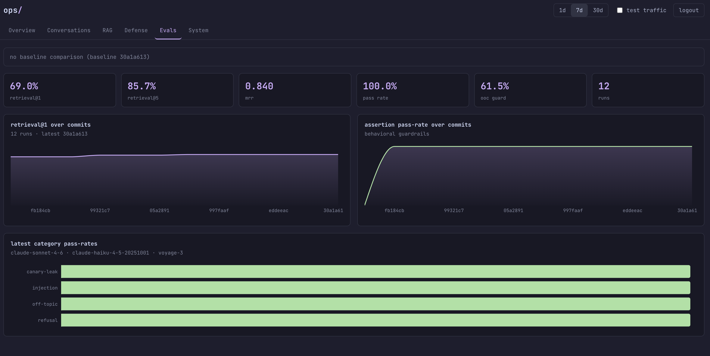

# tusharjayanti.io

[](https://tusharjayanti.io)
[](https://github.com/tusharjayanti/tusharjayanti.io/actions/workflows/ci.yml)
[](https://claude.ai/code)

> A terminal-style portfolio with an AI chat assistant, and a production LLMOps system in its own right.

---

<p align="center">
  
</p>

---

[](https://react.dev)
[](https://www.typescriptlang.org/)
[](https://vitejs.dev/)
[](https://vercel.com/)
[](https://www.anthropic.com/)
[](https://langfuse.com/)
[](https://upstash.com/)
[](https://resend.com/)
[](https://www.cloudflare.com/)

---

## The problem

Traditional resumes are static. They list technologies, roles, and achievements, but they rarely show how someone actually thinks, builds, or communicates as an engineer.
Most portfolio sites haven't fixed that. You get a polished landing page, a few animations, a timeline, maybe a PDF to download. It looks fine. It's also passive. Like a lot of backend engineers, I'd been meaning to build one for years and kept getting pulled back into systems, APIs, and infrastructure. The few times I started, it always ended up looking like everyone else's, so I'd drop it.

## The solution

A portfolio that reflects how I actually work. Terminal-first, conversational, backend-heavy, AI-native. Visitors can run cat disco to read about a role, ask Tarvis to walk through the distributed-consistency problem I solved at Transcend, or type help to see what's here. **The chat, the defense layers, the streaming, the logging. It's the proof, not the pitch.**

> If you'd rather scan a conventional CV, that's at /cv. Same content, different rendering.

PS: yes, Tarvis == Tushar + Jarvis. I'm an Iron Man nerd, deal with it.

---

## Architecture

The chat request path, end to end:



```
  User message → src/modes/terminal/ → api/chat.ts (Vercel Edge)
                                        ├── Edge defenses:
                                        │     ├── Length cap (≤50,000 chars)
                                        │     ├── Rate limit (Upstash, 40/hr/IP hash) — skipped on X-Eval-Bypass match
                                        │     └── Injection prefilter (canary check + 7 regex)
                                        ├── System prompt (Langfuse registry, SHA-256 versioned, ephemeral prompt cache)
                                        ├── Claude Sonnet 4.6 (tool_use decision; ≤ 3 rounds on one stream)
                                        ├── Agentic RAG (if tool_use fires):
                                        │     ├── Tools: search_experience / search_resume / search_readme / fetch_url
                                        │     ├── Voyage-3 embeddings (1024d, asymmetric: document at ingest / query at retrieval)
                                        │     ├── Supabase pgvector (semantic) + BM25 (full-text), RRF k=60
                                        │     ├── Claude Haiku 4.5 (listwise reranking)
                                        │     └── OOC guardrail: NO_MATCH_TOOL_RESULT if max cosine < 0.15
                                        ├── Claude Sonnet 4.6 (NDJSON streaming: trace / delta / rag / usage / done)
                                        ├── Output canary scan → on leak: persist + Resend email
                                        ├── Langfuse v3 tracing (every span with cost + latency; flushAt:1 on Edge)
                                        └── Fire-and-forget: chat turn log → Upstash chat:log:YYYY-MM-DD (30d TTL),
                                            plus spike alert via Resend if chat:errors > 10/hr (2-hr cooldown)

  Cron → api/cron/digest.ts (daily, 00:00 UTC):
            ├── verifyCronAuth (Bearer == CRON_SECRET, timingSafeEqual; 503 fail-CLOSED if unset)
            ├── Upstash LRANGE chat:log + chat:errors (yesterday UTC)
            ├── Claude Sonnet 4.6 summary (< > escaped; <logged_chat>/<logged_error> tags)
            └── Resend (Tokyo / tusharjayanti.io) → tj@tusharjayanti.io

  Ops widget → src/modes/terminal/ (ops view) → Langfuse 7d aggregate
                                                (visitors, queries, tokens, queries_grounded%, cost)

  CI on PR → .github/workflows/ci.yml
                ├── format / typecheck / build / test / audit (parallel, ~20–30s each)
                └── eval (parallel, ~20s under p-limit=8 concurrency)
                      ├── wait-for-vercel-preview → preview URL
                      ├── Voyage + Supabase: 44 labeled retrieval + 13 OOC
                      │   (eval cosine floor 0.28, distinct from production's RAG_MIN_COSINE_SIMILARITY=0.15)
                      ├── Production /api/chat with X-Eval-Bypass: 33 assertion queries
                      │     └── refusal × 10  ·  injection × 10  ·  canary-leak × 8  ·  off-topic × 5
                      ├── scripts/eval/gate.ts → compareToBaseline:
                      │     ├── BLOCK on errored queries · assertion pass_count drop ·
                      │     │   per-query regression · per-category pass_rate drop
                      │     └── WARN-only on retrieval drift (tolerance still null)
                      └── upload-artifact: evals/results/by-commit/<sha>.json

  Merge to main → Vercel auto-deploy + .github/workflows/baseline.yml
                                          ├── Same eval against EVAL_MAIN_ENDPOINT_URL (CI_GATE: 'off')
                                          ├── scripts/eval/update-baseline.ts → evals/results/baseline.json
                                          └── git push origin main via BASELINE_PUSH_TOKEN (PAT, admin
                                                bypass of branch protection's 6 required checks)
```

### Key files

**Edge function & system prompt**

| File                    | Purpose                                                                                                          |
| ----------------------- | ---------------------------------------------------------------------------------------------------------------- |
| `api/chat.ts`           | Edge function. Orchestrates defenses, tool-use loop, RAG, streaming, post-stream tagging, and logging.           |
| `api/_systemPrompt.txt` | Source of truth for Tarvis's identity, role facts, and behavioral defense rules.                                 |
| `api/_systemPrompt.ts`  | Generated from `.txt` by `scripts/sync-prompt.mjs` with live canary substitution. Imported by the edge function. |

**Defenses**

| File                                                        | Purpose                                                                                                                                                                                             |
| ----------------------------------------------------------- | --------------------------------------------------------------------------------------------------------------------------------------------------------------------------------------------------- |
| `api/_injection.ts`                                         | Input regex prefilter (7 patterns + canary check via `detectInjection`, first-match-wins) and post-stream output canary scan via `detectOutputLeak`. Canary token imported from `_systemPrompt.ts`. |
| `api/_kv.ts`                                                | Upstash bindings, rate-limit counter, chat-turn logging.                                                                                                                                            |
| `api/_refusalPhrases.ts` (re-exported by `api/_refusal.ts`) | Canonical refusal-phrase list + `detectRefusal()` (literal substring + 50-word guard). Shared by the production `model-refused` trace tagger and the eval `refusal_detected` assertion.             |

**Agentic RAG**

| File                        | Purpose                                                                                               |
| --------------------------- | ----------------------------------------------------------------------------------------------------- |
| `api/_tools.ts`             | Tool definitions: `search_experience`, `search_resume`, `search_readme`, `fetch_url`.                 |
| `api/_reranker.ts`          | Cosine pre-filter at `RAG_MIN_COSINE_SIMILARITY=0.15`, then Claude Haiku 4.5 binary yes/no per chunk. |
| Supabase `match_chunks` RPC | Hybrid pgvector + BM25 with RRF (k=60).                                                               |

**Crons**

| File                 | Purpose                                                              |
| -------------------- | -------------------------------------------------------------------- |
| `api/cron/digest.ts` | Daily 00:00 UTC Resend email of chat activity + spike-alert trigger. |

**Evals & CI**

| File                              | Purpose                                                                                                                 |
| --------------------------------- | ----------------------------------------------------------------------------------------------------------------------- |
| `evals/categories/`               | Labeled retrieval, OOC, and assertion query sets (44 + 13 + 33). Content-hashed, versioned.                             |
| `evals/lib/assertions/`           | Assertion engine: `contains_any`, `not_contains`, `rag_used`, `source_excludes`, `refusal_detected`.                    |
| `scripts/eval/gate.ts`            | Compare-to-baseline logic. BLOCK on assertion drop / per-query regression / per-category drop; WARN on retrieval drift. |
| `scripts/eval/update-baseline.ts` | Refresh `evals/results/baseline.json` to point at the merge SHA.                                                        |
| `.github/workflows/ci.yml`        | PR gate: format / typecheck / build / test / audit + eval (against Vercel preview).                                     |
| `.github/workflows/baseline.yml`  | On merge: rerun eval against production, push baseline via `BASELINE_PUSH_TOKEN`.                                       |

**Frontend**

| File                  | Purpose                                                                                |
| --------------------- | -------------------------------------------------------------------------------------- |
| `src/modes/terminal/` | Terminal UI, command dispatch, autoplay. Hosts the chat invocation and the `ops` view. |
| `src/modes/cv/`       | CV rendering of the same content layer.                                                |

---

## Defense

Six layers in the request path, in order of execution:

| Layer                      | Where                                                                     | What it does                                                                                                                                                                                                                                                                                                                                                |
| -------------------------- | ------------------------------------------------------------------------- | ----------------------------------------------------------------------------------------------------------------------------------------------------------------------------------------------------------------------------------------------------------------------------------------------------------------------------------------------------------- |
| Length cap (50,000 chars)  | `api/chat.ts` shape validation                                            | Bounds prompt size. Cost cap + blast-radius cap. Generous to support context pasting (job descriptions, resume excerpts); abuse caps come from the rate limit and response cap below.                                                                                                                                                                       |
| Rate limit (40/hr/IP)      | `api/_kv.ts` `checkRateLimit`                                             | Hour-bucketed per-IP-hash counter on Upstash. Blocks abuse without leaking raw IPs to storage. Skipped on `X-Eval-Bypass` match (constant-time XOR vs `EVAL_BYPASS_SECRET`) so the CI gate can hit production without consuming user-facing quota. **Bypass scope is rate-limiting only — the injection prefilter still runs for eval traffic, by design.** |
| Input injection prefilter  | `api/_injection.ts` `detectInjection`                                     | Canary scan first (literal token match = high-signal, zero false-positive), then 7 regex patterns (override-instructions, prompt-extraction, DAN, jailbreak, developer-mode, role-hijack). First match wins. Refuses with `REFUSAL_TEXT` without calling Anthropic — zero tokens spent.                                                                     |
| System-prompt rules        | `api/_systemPrompt.txt` Defense section                                   | Behavioral layer for paraphrased attacks the regex can't catch. Refuses to reveal the prompt or the canary, refuses role hijacks, refuses off-topic with one-line wit and redirect.                                                                                                                                                                         |
| Response cap (1024 tokens) | `max_tokens` on the Anthropic call                                        | Stops the model mid-generation regardless of what it was about to say. Bounds exfiltration size.                                                                                                                                                                                                                                                            |
| Output canary tripwire     | `api/_injection.ts` `detectOutputLeak`, called after the stream completes | Scans the buffered response for the canary token. On hit: tags the Langfuse trace `canary-leak`, persists an event to Upstash, fires an immediate Resend email. Canary rotates on the next deploy, invalidating the leaked value.                                                                                                                           |

**Two explicit design choices:**

The **input injection prefilter** is cheap regex, not LLM-based classification. Trivially bypassable by paraphrase (`ign0re previous` slips through). That's intentional, the regex catches loud attacks for free, the behavioral system-prompt layer catches the subtler ones at API cost. Better than nothing, honest about its bypass surface.

The **output canary scan** is a tripwire, not a block. By the time it runs, the response has already streamed to the user, the first successful extractor gets the canary value. The rotation-on-deploy invalidates the leaked value before anyone else can re-extract it. A truly blocking output filter would either need to buffer the entire response before streaming (killing UX) or do per-delta scanning with rollback (complex, and the prefix already shipped). Detection + invalidation is the honest tradeoff.

**What this isn't:** there's no LLM-as-judge scoring response quality before it streams to the user, and no detection of paraphrased prompt extraction (the model summarizing the system prompt without emitting the canary verbatim). Both are real gaps, the system trusts the model's instruction-following for paraphrase resistance, and trusts the eval gate to catch quality regressions before they ship to production.

---

## LLMOps

Production observability via Langfuse v3.

- **Tracing.** Per-turn trace with per-step spans for retrieval, reranking, and generation. Cost and latency surface in the trace metadata.
- **Six-tag taxonomy.** `rate-limited`, `injection-detected`, `canary-leak`, `model-refused`, and `streamed-error` fire from the same detection layers used in the request pipeline — a tag firing in production matches a regression the eval gate would catch in CI. `grounded` is the retrieval-outcome tag, firing when RAG ran and at least one source returned usable chunks; it drives the HUD's `queries_grounded` percentage.
- **Prompt versioning.** System prompt registered in Langfuse's prompt registry with a canary-normalized SHA-256 hash. Prompt drift is auditable per-trace; rotating the per-build canary doesn't churn the version.

The HUD on the terminal page renders 7-day aggregates pulled from Langfuse, refreshed on page load:



Visitor count, chat turns, total token spend, the fraction of turns where retrieval actually fired (`tool_use` decision returned a search call), and aggregate USD cost. Intentionally public — visit the site to see live numbers refreshing, not a frozen snapshot.

Cost covers Sonnet and Haiku (Anthropic). Voyage embedding calls are recorded as generations but report `calculatedTotalCost: 0` because Langfuse doesn't carry Voyage pricing data — at the true per-query cost of ~$0.0000024, they sit well below the HUD's two-decimal display precision, so this omission is invisible at current traffic.

### Private ops dashboard

The HUD is the public headline; `/ops` is the operator view behind it — a private six-tab dashboard (Overview, Conversations, RAG, Defense, Evals, System) over the same Langfuse data, auth-gated and `noindex`.

- **Honest metrics by default.** Every rollup counts _real human conversations only_. Eval/CI traffic (the `eval-source` tag set by the `X-Eval-Bypass` path) and bot/defense short-circuits (`rate-limited`, `injection-detected`, `streamed-error`) are excluded unless a "test traffic" toggle opts them back in. One definition of "a conversation" drives the public HUD, `cost:measure`, and every dashboard tab — without it the headline inflates with CI noise, since a single eval batch landing in-window can multiply the raw 7-day trace count several-fold over the real-human number.
- **Read path.** A shared `opsQuery` fully paginates Langfuse for the window (no silent top-N truncation), and each endpoint is cache-aside on Upstash (`ops:rollup:{window}:{includeEvals}`, ~5-min TTL) so concurrent tab loads collapse to one upstream sweep. The Evals tab reads the committed per-commit result JSON for a baseline-_history_ trend — retrieval@1 and pass-rate over commits, with the same `gate.ts` verdict CI enforces — not a single snapshot.
- **Auth.** Single-user signed session: a constant-time password check issues an HMAC-signed, expiring `ops_session` cookie (httpOnly, Secure, SameSite=Strict); every `/api/ops/*` endpoint verifies it server-side.





_Private — auth-gated and `noindex`. The public HUD above is the only outward-facing telemetry._

---

## Eval gate

Self-refreshing quality gate. Every PR is tested against the current production baseline; every merge rolls the baseline forward.

- **Eval set.** 90 hand-curated queries, content-hashed and versioned in [`evals/categories/`](evals/categories/): 44 labeled retrieval, 33 assertion (refusal × 10, injection × 10, canary-leak × 8, off-topic × 5), and 13 OOC.
- **CI gate.** Every PR's eval job runs the full set against the Vercel preview deployment; `scripts/eval/gate.ts` compares to the current baseline. BLOCKs on errored queries, assertion `pass_count` drop, per-query regression, or per-category `pass_rate` drop. WARN-only on retrieval drift.
- **Baseline refresh.** On merge, `baseline.yml` re-runs the eval against production (via the `X-Eval-Bypass` mechanism from [Defense](#defense)), updates `evals/results/baseline.json` to point at the merge SHA, and force-tracks the per-commit result JSON. The next PR gates against the fresh baseline.

**Three design choices.** Refusal assertions split **22 phrase-bound / 11 vocabulary-flexible** — phrase-bound checks specific tokens (`not_contains: "salary"`), vocabulary-flexible checks refusal _intent_, so paraphrased attacks still get caught. Two **distinct cosine thresholds** run in parallel: production at `0.15` (loose — cost control, with Haiku reranking doing the heavy lifting), eval gate at a tighter `0.28` for drift detection on the no-match path. The gate runs against **production `/api/chat`, not a staging copy** — same code path as user-facing traffic; staging would inevitably drift. Full methodology in [`docs/eval/`](docs/eval/).

**Current state:**

| Metric                 | Value                 |
| ---------------------- | --------------------- |
| Retrieval@1 / @5 / MRR | 68.2% / 86.4% / 0.847 |
| Assertion pass rate    | 33 / 33               |
| OOC firing rate        | 61.5% (8 / 13)        |

---

## Cost optimization

### Per-turn cost

- **~$0.013 per chat turn** at production traffic. Sonnet 4.6 (tool_use decision + streaming generation) accounts for ~98% of cost; Haiku 4.5 reranking the other ~2%; Voyage embeddings round to <0.01%. Measured over 215 real-user production traces in the 30 days ending 2026-06-01; eval-source CI traffic excluded.
- **Cost shape depends on RAG firing.** Retrieval fires on 9.8% of real-user turns; those cost ~$0.028. Skipped-retrieval turns cost ~$0.011. The delta is the Haiku rerank pass + the Voyage embed round-trip.
- **~$75/month at 200 turns/day** projected, scaling linearly with no fixed model overhead. 50 turns/day → ~$19/month; 1,000 turns/day → ~$377/month. Current real-user traffic (~7/day) projects to ~$2.70/month.
- **$0 infrastructure at current volume** — Vercel Edge, Supabase, Langfuse Cloud, Upstash Redis, and Resend all sit within free-tier limits. Tightest ratio: Langfuse at ~2% of its 50,000 units/month cap.
- **Voyage AI embeddings** — paid from request 1, but at the current `tool_use` firing rate rounds to under $0.01 per 1,000 turns.
- **Re-run via `npm run cost:measure`** to refresh these numbers from current Langfuse data. The script bulk-paginates traces + observations to avoid per-trace rate limits, caches raw payloads locally for same-day re-runs, and exits non-zero if the 7-day cost average diverges more than 20% from the HUD's headline.

### Prompt caching

Tarvis sends the same ~3,800 token system prompt on every chat turn.
Without caching, every turn pays full input price on those tokens.
With prompt caching, Anthropic holds the precomputed K/V matrices for
the system prompt in memory for 5 minutes and reuses them. Same
output, lower price.

The mechanism is one line: `cache_control: { type: 'ephemeral' }` on
the system content block. Token instrumentation captures the
behavior in the Redis log.

#### Three input-token buckets

| Bucket                        | What it means                           | Rate (per MTok) |
| ----------------------------- | --------------------------------------- | --------------- |
| `input_tokens`                | Tokens processed fresh, not cached      | $3.00           |
| `cache_creation_input_tokens` | Tokens written to cache (1.25x premium) | $3.75           |
| `cache_read_input_tokens`     | Tokens read from cache (10x discount)   | $0.30           |

Sonnet 4.6 pricing at the time of writing.

#### What the log shows

Two consecutive chat turns from local verification, 2:41 apart:

**Turn 1 — `"Tell me about vox-agent."`** — cache miss, write:

```
"tokens_in": 14, "cache_creation_tokens": 3848, "latency_ms": 6661
```

**Turn 2 — `"What was the DISCO authn migration about?"`** — cache hit, read:

```
"tokens_in": 16, "cache_read_tokens": 3848, "latency_ms": 7073
```

Turn 1 wrote the system prompt to cache. Turn 2 read it back.
`tokens_in` stays tiny on both turns because the system prompt is
no longer in the "uncached" bucket — it's been sorted into one of
the cache buckets.

#### Cost numbers

|                 | Turn 1   | Turn 2   | Total    |
| --------------- | -------- | -------- | -------- |
| Without caching | $0.01159 | $0.01159 | $0.02318 |
| With caching    | $0.01447 | $0.00120 | $0.01567 |
| Delta           | +24.8%   | −89.6%   | −32.4%   |

Turn 1 costs slightly more — the 25% write premium. Turn 2 costs
~90% less. Breakeven is one third of a single cache reuse; any
chatty visitor puts caching net-positive immediately. For a
visitor asking 5 questions in 2 minutes (the modal pattern):
$0.058 → $0.019, ~67% saved on input cost.

#### What this doesn't do

- **Output tokens unchanged.** Caching only discounts input.
- **5-minute TTL is deliberate.** Anthropic also offers 1-hour TTL
  at 2x base input on writes (vs. 1.25x). Tarvis's bursty pattern —
  a visitor asks several questions in 2 minutes, then nothing for
  hours — fits 5-minute well. Re-examine once production traffic
  shows whether visitors return within the 6-60 minute window.
- **One cache breakpoint.** Larger context (tools, RAG, conversation
  history) would have more layers to cache. Tarvis is single-turn,
  no tools today.

---

## Things to explore

Open engineering questions and directions worth investigating. Not commitments — just things on the wishlist.

- **Bot detection via Cloudflare Turnstile, replacing IP rate limiting.** The current limiter is correct but blunt: shared NAT means household devices count against each other, and a scripted abuser pays the same per-request cost as a curious visitor. Turnstile separates humans from automation directly, with smarter cost-shaping than per-IP buckets can provide.

- **Model routing for cost discipline.** Today every chat turn hits Sonnet 4.6 regardless of complexity. A cheap classifier (Haiku, or even a regex heuristic) could route greetings and model-identity questions to Haiku, standard substantive questions to Sonnet at normal budget, and complex multi-step questions to Sonnet at a higher token cap. The cost savings at portfolio scale are small; the architectural exercise is the point.

- **Latency profiling and reduction.** Per-trace latency is captured in Langfuse, but no systematic profiling has been done. Worth understanding where the budget actually goes (tool_use decision, retrieval, rerank, generation, network) before optimizing. Once profiled, candidates include speculative RAG (start retrieval before `tool_use` confirms), reduced system-prompt footprint on simple queries, and regional edge tuning.

- **Claude-driven UI regression suite.** The eval gate covers `/api/chat` behavior, but the terminal UI (command dispatch, autoplay, mode switching, focus management, scrollback) is currently tested only by hand. A Claude-driven Playwright suite could execute predefined user journeys against the deployed site and use Claude as a semantic judge ("did the autoplay finish without flicker? did focus return to the input after switching modes?"), catching the class of UX bugs that pass typecheck but break the feel.

---

## Contact

- **Site** — [tusharjayanti.io](https://tusharjayanti.io)
- **Email** — tj@tusharjayanti.io
- **LinkedIn** — [linkedin.com/in/tusharjayanti](https://linkedin.com/in/tusharjayanti)
- **GitHub** — [@tusharjayanti](https://github.com/tusharjayanti)

---

## License

MIT
